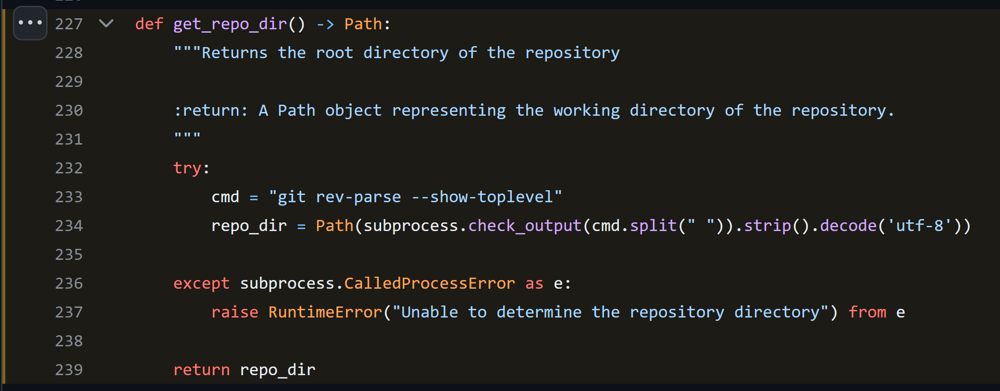

..  Title: Sphinx Github Style
..  Description: A Sphinx extension to add GitHub source code links and syntax highlighting
..  Author: TDKorn (Adam Korn)

.. meta::
   :title: Sphinx Github Style
   :description: A Sphinx extension to add GitHub source code links and syntax highlighting

.. only:: pypi

   sphinx-github-style - GitHub source code links and syntax highlighting for Sphinx documentation
   -------------------------------------------------------------------------------------------------

   .. image:: _static/logo_pypi.png
      :alt: Sphinx GitHub Style: GitHub Integration and Pygments Style for Sphinx Documentation
      :width: 50%
      :align: center

.. raw:: html

   

.. only:: readme

   .. image:: _static/logo_square_grey_blue.png
      :alt: Sphinx GitHub Style: GitHub Integration and Pygments Style for Sphinx Documentation
      :width: 25%

.. only:: html

   .. image:: _static/logo_square.ico
      :alt: Sphinx GitHub Style: GitHub Integration and Pygments Style for Sphinx Documentation
      :width: 25%

.. only:: readme or html

   .. raw:: html

      <h1>Sphinx Github Style</h1>

GitHub source code links and syntax highlighting for Sphinx documentation

.. only:: readme or pypi

   .. |docs| replace:: **Explore the docs »**
   .. _docs: https://sphinx-github-style.readthedocs.io/en/latest/

   |docs|_

.. only:: pypi

   |

.. image:: https://img.shields.io/pypi/v/sphinx-github-style?color=eb5202
   :target: https://pypi.org/project/sphinx-github-style/
   :alt: PyPI Version

.. image:: https://img.shields.io/badge/GitHub-sphinx--github--style-4f1abc
   :target: https://github.com/tdkorn/sphinx-github-style/
   :alt: GitHub Repository

.. image:: https://static.pepy.tech/personalized-badge/sphinx-github-style?period=total&units=none&left_color=grey&right_color=blue&left_text=Downloads
    :target: https://pepy.tech/project/sphinx-github-style/

.. image:: https://readthedocs.org/projects/sphinx-github-style/badge/?version=latest
    :target: https://sphinx-github-style.readthedocs.io/en/latest/?badge=latest
    :alt: Documentation Status

.. raw:: html

   

    
    

.. only:: pypi

   |

About
~~~~~~~~~~~~~

``sphinx-github-style`` is a Sphinx extension that links your documentation to GitHub source code.
It also adds syntax highlighting for code blocks similar to GitHub's pretty lights dark theme.

...

GitHub Source Code Links
===============================

Using :mod:`sphinx.ext.linkcode`,  a ``View on GitHub`` link is added to the documentation of every class, method, function, and property:

.. only:: pypi

   |

.. only:: html

   .. autofunction:: sphinx_github_style.utils.git.get_repo_dir
      :noindex:

.. only:: readme or pypi

   .. image:: _static/github_link.png
      :alt: sphinx-github-style adds a "View on GitHub" link

They link to and highlight the corresponding code block in your GitHub repository:

.. only:: pypi

   |

.. note::

   These links can be :doc:`styled with CSS <add_linkcode_class>` and used with/instead
   of the links added by :mod:`sphinx.ext.viewcode`

Syntax Highlighting
====================

``sphinx-github-style`` also contains a ``Pygments`` style to highlight code blocks similar to GitHub:

.. only:: html

   .. literalinclude:: ../../sphinx_github_style/utils/git.py
      :language: python
      :pyobject: get_repo_dir

.. only:: readme or pypi

   .. image:: _static/syntax_highlighting.png
      :alt: A code block highlighted by the Pygments style. It looks identical to GitHub.

Installation
~~~~~~~~~~~~~~~~

To install using ``pip``::

 pip install sphinx-github-style

Configuration
~~~~~~~~~~~~~~~

Add the extension to your ``conf.py``

.. code-block:: python

   extensions = [
       "sphinx_github_style",
   ]

Optional Configuration Variables
===================================

Add any (or none) of the following configuration variables to your ``conf.py``

.. only:: not readme and not pypi

   .. include:: configuration.rst.src

.. only:: readme or pypi

   :confval:`linkcode_blob`
    The blob to link to on GitHub - any of ``"head"``, ``"last_tag"``, or ``"{blob}"``

     **Type:** ``str``

     **Default:** ``"head"``

    * ``"head"`` (default): links to the most recent commit hash; if this commit is tagged, uses the tag instead
    * ``"last_tag"``: links to the most recent commit tag on the currently checked out branch
    * ``"blob"``: links to any blob you want, for example ``"master"`` or ``"v2.0.1"``

   |

   :confval:`linkcode_url`
    The link to your GitHub repository formatted as ``https://github.com/user/repo``

     **Type:** ``str``

     **Default:** ``f"https://github.com/{html_context['github_user']}/{html_context['github_repo']}/{html_context['github_version']}"``

    * If not provided, will attempt to create the link from the :external+sphinx:confval:`html_context` dict

   |

   :confval:`linkcode_link_text`
    The text to use for the linkcode link

     **Type:** ``str``

     **Default:** ``"View on GitHub"``

   |

   :confval:`linkcode_resolve`
    A ``linkcode_resolve()`` function to use when resolving the link target with :mod:`sphinx.ext.linkcode`

     **Type:** ``Callable``

     **Default:** Return value from :func:`~.get_linkcode_resolve`

